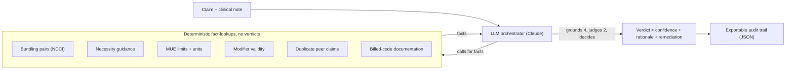

# Verity: Payment Integrity Reasoning Copilot

Agentic, auditable `PAY` / `FLAG` / `DENY` review for a single medical claim.

## Overview

- **The LLM reasons and decides; deterministic tools supply the facts.** The orchestrator reads the claim and its free-text clinical note, calls fact-lookup tools for verifiable codes/limits (so it never guesses medical facts), and itself decides `PAY` / `FLAG` / `DENY` with a cited rationale.
- **The clinical note is a first-class input**, judged by the model, not by a lookup. Medical-necessity, documentation-validation (upcoding / insufficient documentation), and repeat-justification calls are genuine reasoning over unstructured text.
- **The four mechanical concerns are deterministically grounded.** Bundling, frequency/units, modifier validity, and duplicate detection are pure lookups, so their per-concern status is derived directly from the facts rather than re-decided by the model; the LLM owns only the two judgment concerns (necessity and documentation). The final verdict is a strict mapping over all six findings (any `fail` -> `DENY`, else any `flag` -> `FLAG`, else `PAY`).
- **FLAG/DENY carries an actionable remediation**, the concrete next step (add `LT`/`RT` and resubmit, downcode to `99213`, provide the operative note), so a verdict becomes a defensible, appeal-ready artifact.
- **Every step is an exportable audit record** (the model's reasoning turns, each fact-tool call and its returned facts, the final verdict, rationale, and remediation) downloadable as JSON.
- **Deliberately scoped POC** for the Cotiviti GenAI assessment (Topic 2: chain reasoning, agentic GenAI). Not production software: no auth, no database, no PHI, illustrative code tables over 10 synthetic claims.

## Quickstart

```bash
npm install
cp .env.example .env.local     # set ANTHROPIC_API_KEY=sk-ant-...
npm run dev                    # http://localhost:3000
```

Open the app, pick claim **`C-1010`**, and click **Run review** to watch the agent reason step by step. Verity is live-first: without a key it shows a pre-generated offline **Sample** (claim C-1010) so the UI is still explorable.

## Architecture

The LLM orchestrator drives the investigation: it reads the claim and clinical note, calls deterministic fact tools, reasons over what they return, and decides the disposition. Every reasoning turn and tool call is recorded.



## How it works

- **The orchestrator (LLM)** calls the fact tools, reasons over the results and the clinical note, and produces a confidence, a plain-English rationale, a remediation, and a per-concern finding for each of the six checks. It owns the two judgment concerns (necessity, documentation); the four mechanical concerns are grounded deterministically after parsing (see below).
- **The six tools** are pure functions in [`src/lib/rules.ts`](src/lib/rules.ts). Each returns *facts* (code pairs, MUE limits, modifier validity, peer claims, necessity references, billed-code documentation), never a verdict. They keep the model's hard facts honest so it cannot hallucinate a code or a limit.

Because the model owns the judgment, it is instructed to call the fact tools rather than recall codes from memory; the deterministic layer grounds it.

## Deterministic grounding vs. LLM judgment

The four mechanical concerns (bundling, frequency/units, modifier validation, duplicate) are pure lookups over the claim. `groundedFinding` in [`src/lib/rules.ts`](src/lib/rules.ts) derives their status directly from the facts, and [`src/lib/agent.ts`](src/lib/agent.ts) replaces the model's findings for those four after parsing. This removes a class of avoidable errors (for example a spurious `modifier_validation: fail` when nothing is wrong). The model keeps the two concerns that genuinely need the note, medical necessity and documentation validation, plus the confidence, rationale, and remediation. The verdict is then a strict mapping over all six findings.

## The six concerns

| Concern | What decides it | Example trigger |
|---|---|---|
| Bundling (NCCI) | Grounded: bundled CPT pair billed together without a bypass modifier | `80053` (CMP) + `82565` (creatinine) same day |
| Medical necessity | LLM judgment from the clinical note | `70450` (CT head) with only `Z00.00` (routine exam) |
| Frequency / units | Grounded: per-day units vs. the MUE max, allowing a documented repeat | `93000` billed 4 units, no repeat modifier |
| Modifier validation | Grounded: unrecognized modifier, or missing required laterality | `27447` (TKA) with no `LT`/`RT`, or an invalid modifier |
| Duplicate claim | Grounded: an earlier peer claim matches member + DOS + overlapping CPT | `C-1006` duplicates `C-1005` |
| Documentation validation | LLM judgment: does the note support the billed code and its level? | `99215` billed for a brief stable recheck (upcoding) |

> Illustrative editing tables for a demo, not the full NCCI/MUE files. The necessity tool returns ICD-10 prefix guidance as a *reference signal only*; the model judges necessity from the clinical note. Tables live in [`src/lib/codeTables.ts`](src/lib/codeTables.ts).

## Worked example: a justified repeat (claim C-1010)

This example shows the model avoiding an incorrect denial by reading the clinical note. Claim `C-1010` bills two electrocardiograms (`93000`) on the same date of service; the second line carries modifier `76` (repeat procedure by the same physician).

1. The model calls the frequency tool and sees two units against an MUE maximum of one per day, a potential overpayment on its face.
2. It reads the clinical note (a documented repeat after an acute symptomatic episode) and the modifier-76 fact, and reasons that the repeat is medically justified and billed on a separate line.
3. With every concern satisfied, it decides `PAY`, citing the repeat justification.

The full reasoning chain, tool calls, and returned facts are written to the audit trail, so the decision is traceable. Remove modifier `76` (or the supporting note) and the model has grounds to deny.

## Confidence

Confidence is **model-assessed and indicative, not a calibrated probability**: the orchestrator reports how sure it is alongside its verdict. Treat it as a rough signal, not a statistical guarantee. A production version would calibrate confidence against a labeled outcome set (per-disposition, per-rule) rather than rely on the model's self-report.

## Evaluation

The **Evaluation** tab runs every labeled claim through the *live* agent and scores each verdict against its ground-truth label, with a per-rule breakdown of which concern drove each decision.

> Honest caveat: because the agent reasons with an LLM, this is a small sanity check on hand-labeled cases, not evidence of generalization, and results can vary between runs. A real accuracy claim needs an independent, naturally-distributed labeled set scored on per-disposition precision/recall, tracked per rule and monitored for drift.

## Tech stack

- **Framework:** Next.js 16 (App Router, Turbopack) + React 19 + TypeScript
- **Styling:** Tailwind CSS v4 + shadcn/ui
- **Agent graph:** @xyflow/react (React Flow)
- **Motion:** Framer Motion
- **Icons:** lucide-react
- **LLM:** Anthropic Claude via `@anthropic-ai/sdk` (decision-maker); offline canned sample when no key is set
- **Report & deck tooling:** Python (`python-docx`, `python-pptx`) in `tools/`, which regenerates the assessment report and slides; not part of the running web app

## What a production version would add

- **HIPAA / PHI handling:** encryption, a signed BAA with the LLM provider, prompt PHI minimization, access control and audit logging.
- **Real edit content:** full NCCI PTP / MUE files and LCD/NCD necessity policies, versioned and dated, instead of illustrative tables and prefix matching.
- **Human-in-the-loop:** FLAG/DENY routed to analysts with accept/override and a provider appeal workflow.
- **Evaluation pipeline:** precision/recall per disposition on a large labeled sample, per-rule performance, and regression tests in CI.
- **Upstream detection:** pair this reasoning layer with statistical pattern recognition (classification / risk tiering, clustering for provider cohorts, time-series anomaly detection) to surface and prioritize candidates before per-claim review.

## References

Editing logic is modeled on a small, illustrative subset of real public sources, not the complete files or coverage policy:

- CMS National Correct Coding Initiative (NCCI), PTP edits and MUEs: <https://www.cms.gov/medicare/coding-billing/national-correct-coding-initiative-ncci-edits>
- CMS NCCI Policy Manual (edit rationale; confirms modifiers 76/77 are not PTP-bypass modifiers): <https://www.cms.gov/medicare/coding-billing/national-correct-coding-initiative-ncci-edits/medicare-ncci-policy-manual>
- CMS Medicare Coverage Database, LCDs / NCDs (medical necessity): <https://www.cms.gov/medicare-coverage-database/>
- ICD-10-CM diagnosis codes (CDC / NCHS): <https://www.cdc.gov/nchs/icd/icd-10-cm/files.html>
- CPT codes and modifiers: American Medical Association (AMA), Current Procedural Terminology (CPT).

## Assessment context

Built for the Cotiviti GenAI intern assessment, Topic 2 (*Clinical Decision Making and Pattern Recognition*). All sample data is synthetic. Author: Srinidhi Jagannathan, MS Business Analytics, Santa Clara University.
